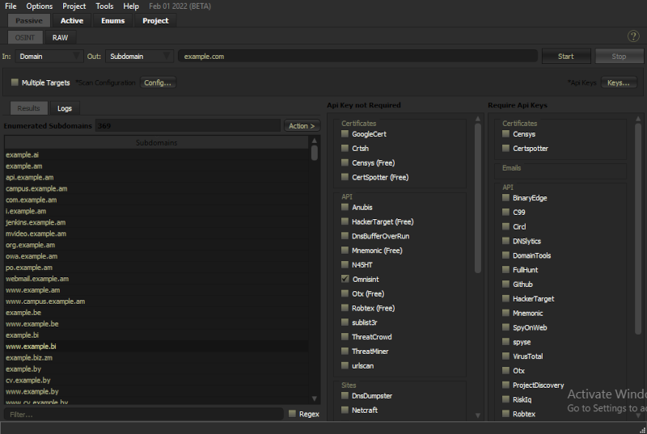
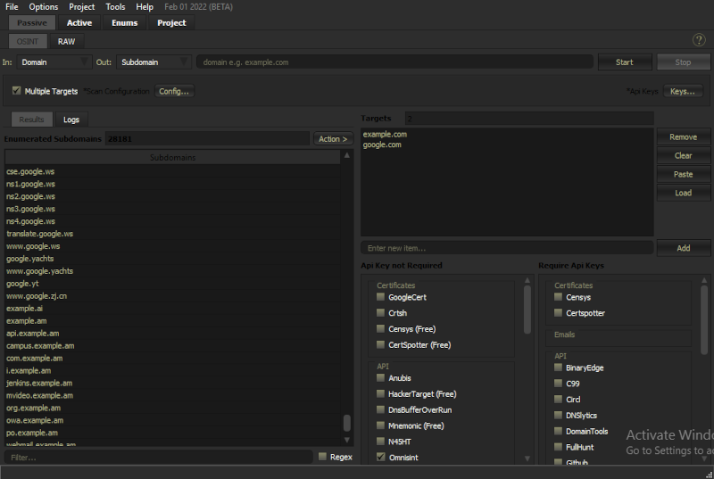

# OSINT ENGINE

## What is?

The Osint engine is used for obtaining different types of osint data from different input types.
The tool uses different osint modules to obtain the desired data.

Each Module gets its own thread for querying the same targets. for multiple targets the thread queries on target after
another due to query request's rate limits impossed by most modules.

## Modules

The osint engine uses different osint source to obtain its results.
The osint modules are mainly categorized in two major groups; Those that require API keys & those that do not require API keys.
They are further categorized into different sub-groups depending on the type that the osint source majorly deals with.

### The Osint Source's Sub-groups

**--> Certificates sub-group:**  These Osint Sources majorly contains resources associating with SSL Certificates gathered for different sites.
**--> Emails sub-group:** These Osint Sources majorly deals with osint of emails.
**--> API sub-group:** These are Osint Sources that contain a variety of osint API endpoints.
**--> Archives sub-group:** These are Osint Sources containing archives of different internet entities.
**--> Scrape sub-group:** These are Osint modules that obtain data by scrapping the indicated search engine.
**--> Site sub-group:** These are Osint modules that obtain data from different website containing osint info.

## Features 

1. Supports different Input types to different Output types.
2. Supports querying for multiple targets.

### Input Types 

1. Hostname.
2. Ip Address.
3. Email.
4. Url.
5. ASN.
6. SSL Certificate Hash.
7. CIDR.

### Output Types

1. Subdomains.
2. Subdomain & Ip.
3. Ip Address.
4. Email.
5. Url.
6. ASN.
7. SSL Certificate Hash.
8. CIDR.

## Usage & Examples

Image showing enumeration of Target input "example.com" to obtain subdomain results.

Image showing enumeration of Multiple input targets "example.com & google.com" to obtain subdomain results.

Help improve the [documentation](https://github.com/3nock/s3s_doc)

## References

1. (https://blog.appsecco.com/a-penetration-testers-guide-to-sub-domain-enumeration-7d842d5570f6)

## NOTE:

*This is a very simple documentation on the Tool. It still doesn't contain many information on the many features of the tool & on how to effectively use the tool.*

*Help improve the [documentation](https://github.com/3nock/sub3suite_doc).*